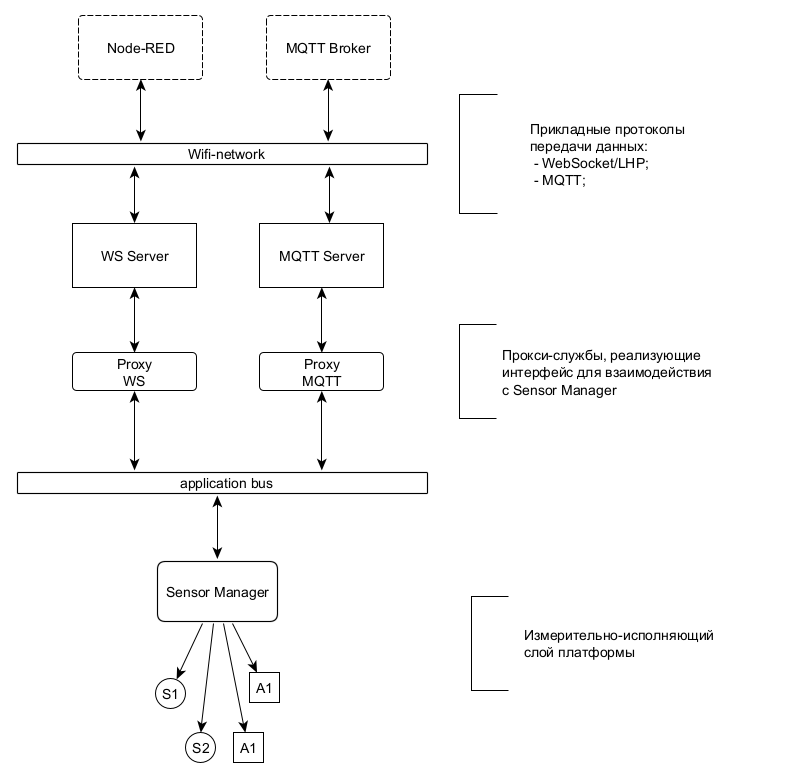
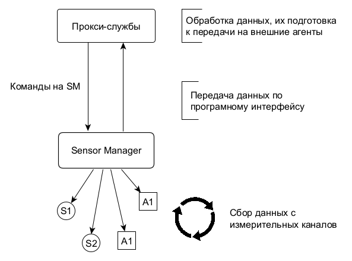

<div style = "font-family: 'Open Sans', sans-serif; font-size: 16px">

# ModuleSensor
<div style = "color: #555">
    <p align="center">
    
    </p>
</div>

## Лицензия
////

### Описание
<div style = "color: #555">

DeviceManager - системная служба, ключевой компонент фреймворка Horizon Automated, разработанный для обеспечения взаимодействия между серверным уровнем, к которому могут относиться, к примеру, MQTT-брокер или Node-RED сервер, и полевым уровнем, который включает в себя все инициализированные на платформе датчики и актуаторы. Данная служба предоставляет следующие функции:
- Ведение реестра датчиков и актуаторов. Все программные модули датчиков/актуаторов, реализованные в соответствии с архитектурой [plcSensor](../../plcSensor/res/README.md)/[plcActuator](../../plcActuator/res/README.md), при инициализации автоматически регистрируются в DevicesManager. Таким образом служба обеспечивает доступ ко всему измерительно-исполняющему слою платформы через единый интерфейс, с которым можно взаимодействовать как со стороны сервера, так и в рамках контроллера;
- Периодический сбор показаний с измерительных каналов. Sensor Manager содержит механизм, который по запросу внешнего агнета запускает циклический сбор данных со всех измерительных каналов зарегистрированных на платформе датчиков. При этом данные, которые не обновились с момента последней итерации, пропускаются. Собранные данные далее поступают на сервер посредством установленных каналов связи;
- Сбор и передача метаданных метаданных от всех датчиков и актуаторов. Предоставляет целостную информацию о каждом измерительном/исполняющем устройстве на платформе Horizon Automated;
- Прием и перенаправление команд. Принимает команды от сервера и направляет их соответствующим датчикам и актуаторам. Обеспечивает возможность контролировать процессы полевого уровня платформы с сервера;

<div align='center'>
    
</div>

#### Взаимодействие с прокси-службами

Диаграмма выше демонстрирует, что Sensor Manager не взаимодействует с клиент-серверными службами напрямую. Вместо этого он ведет двунаправленный обмен сообщениями с их прокси-службами. 

<div align='center'>
    
</div>

</div>

### Поля
<div style = "color: #555">

- <mark style="background-color: lightblue">_Devices</mark> - массив, хранящий ссылки на объекты инициализированных датчиков и актуаторов.
</div>

### Аксессоры
<div style = "color: #555">

- <mark style="background-color: lightblue">Sensors</mark> - геттер, возвращающий массив со ссылками только на датчики;
- <mark style="background-color: lightblue">Actuators</mark> - геттер, возвращающий массив со ссылками на актуаторы;
</div>

### События
<div style = "color: #555">

- <mark style="background-color: lightblue">dm-start-polling</mark> - запрос на запуск циклического опроса датчиков и пакетной рассылки собранных показаний;
- <mark style="background-color: lightblue">dm-stop-polling</mark> - прекращение опроса;
- <mark style="background-color: lightblue">dm-deviceslist-get</mark> - запрос на сбор списка инициализированных девайсов;
- <mark style="background-color: lightblue">dm-actuator-set</mark> - команда задать состояние актуатора;
- <mark style="background-color: lightblue">all-data-raw-get</mark> - рассылка показаний сенсоров.

</div>

### Методы
<div style = "color: #555">

- <mark style="background-color: lightblue">CreateDevice(id, opts)</mark> - создает датчик/актуатор;
- <mark style="background-color: lightblue">AddDevice(device)</mark> - добавляет устройство в реестр;
- <mark style="background-color: lightblue">GetDevice(id)</mark> - Возвращает устройство с соответствующим id;
- <mark style="background-color: lightblue">GetChannel(chId)</mark> - возвращает канал устройства по его id;
- <mark style="background-color: lightblue">StartPolling(_freq)</mark> - запускает периодическое считывание данных с сенсоров;
- <mark style="background-color: lightblue">StopPolling()</mark> - прекращает периодический опрос датчиков;
- <mark style="background-color: lightblue">OnDevicesListGet()</mark> - собирает и возвращает список зарегистрированных сенсоров и актуаторов;
- <mark style="background-color: lightblue">StopPolling()</mark> - прекращает периодический опрос датчиков;
- <mark style="background-color: lightblue">ActuatorSet(arg)</mark> - задает состояние указанному актуатору;
- <mark style="background-color: lightblue">SendData(dataPackage)</mark> - рассылает собранные данные с датчиков;
- <mark style="background-color: lightblue">SendInfo(InfoArr)</mark> - рассылает пакет с информацией(метаданными) о всех датчиках;
- <mark style="background-color: lightblue">IsIDAvailable()</mark> - выполняет инициализацию всех шин, указанных в конфиге к текущей программе;
- <mark style="background-color: lightblue">IsIDUnique(_id)</mark> - проверяет ID сенсора/актуатора и возвращает булевое значение, указывающее можно ли этот ID использовать;
- <mark style="background-color: lightblue">ArePinsAvailable(_pins)</mark> - проверяет не заняты ли пины другими датчиками.

</div>

### Примеры
<div style = "color: #555">

```js
// Создание объекта датчика
let sht_channels = H.DeviceManager.Service.CreateDevice('02');
let tmprt = sht_channels[0];
let hmdt = sht_channels[1];
```

#### Результат выполнения:

<div align='left'>
    
</div>

</div>

### Зависимости
<div style = "color: #555">

- <mark style="background-color: lightblue">[plcSensor](../../plcSensor/res/README.md)</mark>
- <mark style="background-color: lightblue">[plcActuator](../../plcActuator/res/README.md)</mark>
- <mark style="background-color: lightblue">[plcAppError](../../plcAppError/res/README.md)</mark>
</div>

</div>
    