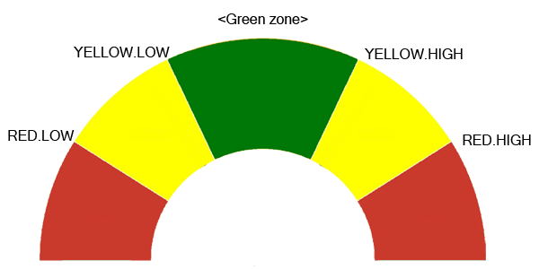

### ClassSensorAncestor
Самый "старший" предок в иерархии классов датчиков. 
В первую очередь собирает в себе самые базовые данные о датчике: переданные шину, пины, адрес и тд. 
Также сохраняет его описательную характеристику:
- id
- артикль
- кол-во каналов
- имя 
- тип устройства
- тип вх. и вых. сигналов
- названия каналов
- допустимые типы шин (эти данные далее не используются)
- ManufacturingData

При инициализации специфическим образом обрабатываются гибриды. Об этом ниже 

Данные свойства помимо id и кол-ва каналов технически не являются обязательными, но если они были переданы, то выполняется проверка на корректность ввода

Данный класс можно объединить с аналогичным классом актуатора и преобразовать в некий ClassDevice

### ClassMiddleSensor
Создает объекты каналов в качестве поля _Channels, объявляет свойства, реализующие передачу данных(измерений) на объект Channel[i] и хранение статусов
Объявляет следующие поля:
```js
/**
* @method
* Метод обязывающий провести инициализацию датчика настройкой необходимых для его работы регистров 
* @param {Object} [_opts] 
*/
Init(_opts) { }
/**
* @method
* Метод обязывает запустить циклический опрос определенного канала датчика с заданной периодичностью в мс. Переданное значение периода должно сверяться с минимальным значением для данного канала и, если требуется, регулироваться, так как максимальная частота опроса зависит от характеристик датчика. 
* 
* @param {Number} _ch_num - номер канала 
* @param {Number} [_period] - период опроса в мс
* @param {Object} [_opts] - необязательный параметр, позволяющий передать дополнительные аргументы
* @returns {Boolean} 
*/
Start(_ch_num, _period, _opts) { }
/**
* @method
* Метод обязывает прекратить считывание значений с заданного канала. 
* В случаях, когда значения данного канала считываются синхронно с другими, достаточно прекратить обновление данных.
* @param {Number} _ch_num - номер канала, опрос которого необходимо остановить
*/
Stop(_ch_num) { }
/**
* @method
* Метод обязывает остановить опрос указанного канала и запустить его вновь с уже новой частотой. Возобновиться должно обновление всех каналов, которые опрашивались перед остановкой.  
* @param {Number} _ch_num - номер канала, частота опроса которого изменяется
* @param {Number} _period - новый период опроса
*/
ChangeFreq(_ch_num, _period) { }
/**
* @method
* Метод обязывающий выполнить дополнительную конфигурацию датчика. Это может быть настройка пина прерывания, периодов измерения и прочих шагов, которые в общем случае необходимы для работы датчика, но могут переопределяться в процессе работы, и потому вынесены из метода Init() 
* @param {Object} [_opts] - объект с конфигурационными параметрами
*/
Configure(_ch_num, _opts) { }
/**
* @method
* Метод, предназначенный для получения дополнительных сведений об измерительном канале или физическом датчике
* @param {Number} _ch_num 
* @param {Object} _opts 
*/
GetInfo(_ch_num, _opts) { }
/**
* @method
* Метод обязывающий выполнить перезагрузку датчика
*/
Reset() { }
/**
* @method
* Метод устанавливающий значение повторяемости
* @param {Number | String} _rep - повторяемость
*/
SetRepeatability(_rep) { }
/**
* @method
* Метод устанавливающий точность измерений
* @param {Number | String} _pres - точность
*/
SetPrecision(_pres) { }
/**
* @method
* Метод который обязывает запустить прикладную работу датчика, сперва выполнив его полную инициализацию, конфигурацию и прочие необходимые процедуры, обеспечив его безопасный и корректный запуск
* @param {Number} _ch_num - номер канала
* @param {Object} _opts - параметры для запуска
*/
Run(_ch_num, _opts) { }
/**
* @method
* Метод обеспечивающий чтение с регистра
* @param {Number} _reg 
*/
Read(_reg) { }
/**
* @method
* Метод обеспечивающий запись в регистр
* @param {Number} _reg 
* @param {Number} _val 
*/
Write(_reg, _val) { }
```

### ClassChannelSensor
Класс, представляющий каждый отдельно взятый канал датчика. Каждый канал является "синглтоном" для своего родителя.
Реализует хранение сырых данных в буффере их обработку. Интерфейс для получения данных пользователем - геттер Value

Для обработки композирует в себе объекты _DataRefine и _Alarms. Alarms не создается по вызову метода

Предоставляет флаги "были ли данные считаны", "последние данные не были считаны" 
Предоставляет свойство ChangeThreshold - задает чувствительность изменения данных которую использует DevicesManager

### ClassDataRefine
Класс реализующий функционал для обработки числовых значений по задаваемым ограничителям (лимитам) и заданной линейной функции


Реализует следующие методы:
```js
/**
* @method
* Метод устанавливает фильтрующую функцию для канала
* @param {Function} _func - фильтр-функция
* @returns 
*/
SetFilterFunc(_func)
/**
* @method
* Метод устанавливает границы супрессорной функции
* @param {Number} _limLow 
* @param {Number} _limHigh 
*/
SetLim(_limLow, _limHigh)
/**
* @method
* Метод возвращает значение, прошедшее через супрессорную функцию
* @param {Number} val 
* @returns {Number}
*/
SuppressValue(val) 
/**
* @method
* Устанавливает коэффициенты k и b трансформирующей линейной функции 
* @param {Number} _k 
* @param {Number} _b 
*/
SetTransformFunc(_k, _b)
/**
* @method
* Возвращает значение, преобразованное линейной функцией
* @param {Number} val 
* @returns 
*/
TransformValue(val)
```

### ClassAlarms
Реализует функционал для работы с зонами и алармами 
Хранит в себе заданные границы алармов и соответствующие им колбэки.
Границы желтой и красной зон определяются вручную, а диапазон зеленой зоны фактически подстраивается под желтую (или красную если желтая не определена).



Реализует следующие методы:
```js
/**
 * @method
 * Устанавливает значения полей класса по-умолчанию
 */
Init()
/**
 * @method
 * Метод, который задает зоны измерения и их функции-обработчики
 * @param {Object} opts 
 */
SetZones(opts)
/**
 * @method
 * Метод обновляет значение текущей зоны измерения по переданному значению и, если зона сменилась, вызывает её колбэк
 * @param {Number} val 
 */
CheckZone(val)
```

### Пример 
```js
let vl_channels = DevicesManager.CreateDevice('00');
let light = vl_channels[0];              
let range = vl_channels[1];

range.SetFilterDepth(2);                 //устанавливает глубину фильтра 

range.DataRefine.SetFilterFunc(
  (raw_values) => {                      //устанавливает фильтрующую функцию для канала. 
    return raw_values.reduce((a, b) => a + b, 0);  // возврат среднего арифметического
  }
);

range.DataRefine.SetTransformFunc(0.001, 0);  // переводим показания из мм в метры

range.DataRefine.SetLim(0, 0.2);              // устанавливаем верхнюю границу в 20 см 

light.Start();
range.Start();


light.EnableAlarms();

light.Alarms.SetZones({         
  red: {              //Красная зона
    low:   -100, 
    high:   100, 
    cbLow:  (ch, prev) => { console.log('L_RED '+ ch.Value); }, 
    cbHigh: (ch, prev) => { console.log('Now in High RED zone: '+ (ch.Value).toFixed(2) + ' lux'); }
  },
  yellow: {           //Желтая зона
    low:   -50, 
    high:   50, 
    cbLow:  (ch, prev) => { console.log('L_YELLOW ' + ch.Value); }, 
    cbHigh: (ch, prev) => { console.log('Now in High YELLOW zone: ' + (ch.Value).toFixed(2) + ' lux'); } 
  },
  green: {            //Зеленая зона
    cb:     (ch, prev) => { console.log(`Left ${prev} zone, now in GREEN zone`); } 
  }
});
```

### Гибриды
При инициализации гибрида массив ID субдевайсов преобразуется в массив массивов их объектов каналов
```json
"17": {
    "pins": ["P11"],
    "name": "DigitalLed",
    "article": "",
    "type": "actuator",
    "channelNames": ["light"],
    "typeInSignals": ["digital"],
    "quantityChannel": 1,
    "busTypes": [],
    "manufacturingData": {},
    "modules": ["ModuleDigitalLed.min.js"]
},
"18": {
    "pins": ["A3"],
    "subDevice": ["17"],    
    "defaultState": 1,  // 0 - вкл, 1 - выкл
    "name": "BistableButton",
    "article": "",
    "type": "hybrid",   // Обратите внимание
    "channelNames": ["press"],
    "typeInSignal": "analog",
    "typeOutSignal": "digital",
    "quantityChannel": 1,
    "busTypes": [],
    "manufacturingData": {},
    "modules": ["ModuleBistableButton.min.js"]
}
```