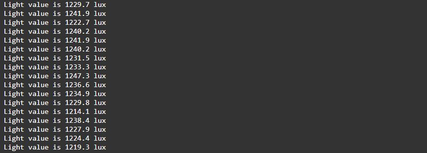

<div style = "font-family: 'Open Sans', sans-serif; font-size: 16px">

# ModuleLightGL5528

<div style = "color: #555">
    <p align="center">
    
    </p>
</div>

## Лицензия

<div style = "color: #555">
В разработке
</div>

## Описание
<div style = "color: #555">

Модуль предназначен для работы с аналоговым датчиком освещенности GL5528 в рамках фреймворка Horizon Automated. Разработан в соответствии с нотацией архитектуры датчиков и является потомком класса [ClassSensor](../../plcSensor/res/README.md). Предоставляет 2 измерительных канала. 

Датчик GL5528 представляет собой фоторезистор, сопротивление которого изменяется в зависимости от уровня освещенности. При увеличении освещенности сопротивление падает, что приводит к увеличению выходного напряжения. Этот аналоговый сигнал преобразуется значение сопротивления фоторезистора для 1-го канала и в значение освещенности для 0-го.

Показания освещенности рассчитываются по формуле `f(resistance): k * resistance ^ p)`. Можно указать значения коэффициентов k и p в конфиге, а также менять их в ходе работы программы. 

GL5528 имеет следующие технические параметры: темновое сопротивление 1 МОм, сопротивление при освещенности 10 Люкс – 10-20 кОм, спектральная чувствительность в диапазоне 400-700 нм. Диапазон измерений составляет от 0 до 1000 Люкс.

Датчик GL5528 крайне неточный и требует тщательной калибровки для получения достоверных результатов. Его показания могут значительно варьироваться в зависимости от условий эксплуатации. Изменение температуры окружающей среды может влиять на его сопротивление, что требует дополнительной компенсации. Показатели могут меняться со временем, что также требует периодической калибровки.

</div>

## Конструктор
<div style = "color: #555">

Конструктор принимает данные из конфига. Пример ниже:
```json
"gl": {
    "k": 32017200,
    "p": -1.5832,
    "pins": ["A3"],
    "name": "GL5528",
    "article": "02-501-0105-201-0003",
    "type": "sensor",
    "channelNames": ["light", "resistance"],
    "quantityChannel": 2,
    "modules": ["plcLightGL5528.min.js"]
}
```
</div>

### Поля
<div style = "color: #555">

- <mark style="background-color: lightblue">_Interval</mark> - поле для хранения ссылки на интервал опроса датчика.
</div>

### Методы
<div style = "color: #555">

- <mark style="background-color: lightblue">Start()</mark> - запускает циклический опрос измерительного канала датчика;
- <mark style="background-color: lightblue">Stop()</mark> - прекращает считывание значений с заданного канала;
- <mark style="background-color: lightblue">Configure()</mark> - настраивает коэффициенты для преобразования освещенности.
</div>

### Возвращаемые данные
<div style = "color: #555">
Датчик возвращает значение освещенности в люксах. 

</div>

### Примеры
<div style = "color: #555">
Пример программы для вывода данных раз в одну секунду:

```js
//Создание объекта класса
let gl5528 = H.DeviceManager.Service.CreateDevice('gl');
let light = gl5528[0];
let r = gl5528[1];

light.Configure({ k: 32017200, p: -1.5832 });

// Запускаем опрос 
light.Start(50);

let interval = setInterval(() => {
    console.log(`Light value is ${(light.Value).toFixed(1)} Lux`);
    console.log(`Resistance is ${(r.Value).toFixed(0)} Ohm`);
}, 1000);
```
Результат выполнения:
<div align='left'>
    
</div>

</div>

### Зависимости
<div style = "color: #555">

</div>

- <mark style="background-color: lightblue">[plcSensor](../../plcSensor/res/README.md)</mark>
- <mark style="background-color: lightblue">[plcAppError](../../plcAppError/res/README.md)</mark>
</div>
