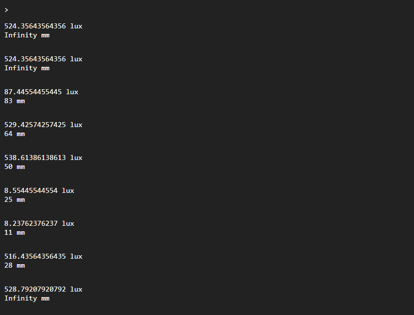

<div style = "font-family: 'Open Sans', sans-serif; font-size: 16px">

# ModuleVL6180

<div style = "color: #555">
    <p align="center">
    
    </p>
</div>

## Лицензия

<div style = "color: #555">
В разработке
</div>

## Описание
<div style = "color: #555">

Модуль предназначен для работы с датчиком VL6180 в рамках фреймворка Horizon Automated. Реализует функции датчика освещенности и расстояния. Соответственно количество измерительных каналов - 2. Модуль работает по протоколу I2C на частоте 400кГц, разработан в соответствии с нотацией архитектуры датчиков и является потомком класса [ClassSensor](../../plcSensor/res/README.md). 

Датчик VL6180 применяется в сценариях, где важно определение близкого приближения объектов, а не абсолютное измерение расстояния с высокой точностью. VL6180 использует технологию Time-of-Flight (ToF) для измерения расстояния, а также встроенный ALS (Ambient Light Sensor) для измерения освещенности.

Технические характеристики VL6180 включают: диапазон измерений расстояния от 0 до 200 мм, диапазон измерений освещенности от 0 до 1000 люкс, и точность освещенности ±5%. Рабочее напряжение датчика составляет от 2.6 В до 3.3 В.

При использовании только одного канала, датчик работает с периодичностью в 120 мс. При опросе двух каналов, датчик чередует замеры освещенности и расстояния, таким образом, периодичность опроса одного канала составляет уже 240 мс.
</div>

## Конструктор
<div style = "color: #555">

Конструктор принимает данные из конфига. Пример ниже:
```json
"00": {
    "name": "VL6180",
    "bus": "I2C11",
    "address": 0x29,
    "article": "02-501-0102-201-0004",
    "type": "sensor",
    "channelNames": ["light", "range"],
    "quantityChannel": 2,
    "modules": ["plcVL6180.min.js"]
}
```
- <mark style="background-color: lightblue">bus</mark> - объект класса I2C, возвращаемый диспетчером I2C шин - [I2Cbus](https://github.com/Konkery/ModuleBaseI2CBus/blob/main/README.md);
- <mark style="background-color: lightblue">address</mark> - адрес датчика на шине;

</div>

### Поля
<div style = "color: #555">

- <mark style="background-color: lightblue">_MinPeriod</mark> - минимальная частота опроса датчика - 120 мс;
- <mark style="background-color: lightblue">_Interval</mark> - функция SetInterval для опроса датчика.
</div>

### Методы
<div style = "color: #555">

- <mark style="background-color: lightblue">Init(_sensor_props)</mark> - проводит инициализацию датчика настройкой необходимых для его работы полей и регистров;
- <mark style="background-color: lightblue">Configure()</mark> - конфигурирует работу датчика;
- <mark style="background-color: lightblue">Start(_num_channel)</mark> - запускает циклический опрос определенного канала датчика со стандартной периодичностью;
- <mark style="background-color: lightblue">Stop(_num_channel)</mark> - прекращает считывание значений с заданного канала;
- <mark style="background-color: lightblue">PerformSingle(_num_channel)</mark> - запускает единичный замер с указанного канала;
- <mark style="background-color: lightblue">UpdateValues()</mark> - считывает показания датчиков с регистров и приводит их к люксам и мм.
- <mark style="background-color: lightblue">SetAddress(addr)</mark> - аппаратно устанавливает адрес датчика на шине и поле Address.
</div>

### Возвращаемые данные
<div style = "color: #555">
Датчик предоставляет данные об освещённости окружения в люксах (lux) и расстояние до препятствия в мм. 
</div>

### Примеры
<div style = "color: #555">
Пример программы для вывода данных раз в одну секунду:

```js
//Инициализация каналов датчика
let vl6180_channels = H.DeviceManager.Service.CreateDevice());

const ch0 = vl6180_channels[0];
const ch1 = vl6180_channels[1];
ch0.Start();
ch1.Start();

setInterval(() => {
    if (ch0.Status)
        console.log((ch0.Value).toFixed(1) + "lux");
    if (ch1.Status)
        console.log((ch1.Value).toFixed(1) + "mm");
}, 1000);
```
Результат выполнения:
<div align='center'>
    
</div>

</div>

### Зависимости
<div style = "color: #555">

- <mark style="background-color: lightblue">[plcSensor](../../plcSensor/res/README.md)</mark>
- <mark style="background-color: lightblue">[plcAppError](../../plcAppError/res/README.md)</mark>
</div>

</div>
