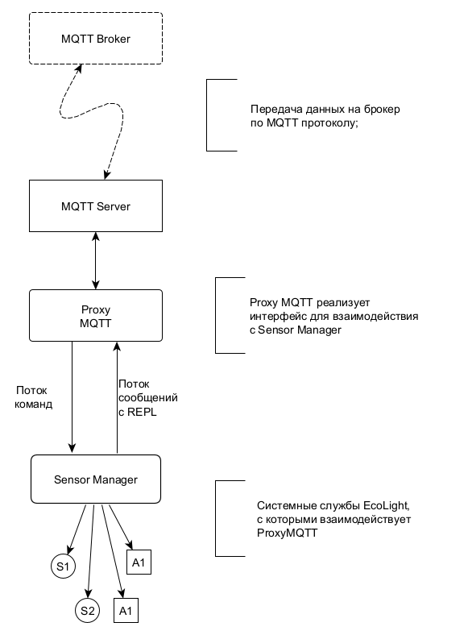

<div style = "font-family: 'Open Sans', sans-serif; font-size: 16px">

# ModuleProxyMQTT
<div style = "color: #555">
<p align="center">
    
    </p>
</div>

## Лицензия
<div style = "color: #555">В разработке</div>

## Описание
<div style = "color: #555">

Модуль ProxyMQTT предназначен для обеспечения обмена сообщениями между MQTT-брокером и некоторыми системными службами фреймворка Horizon Automated. 
Представляет из себя не самостоятельное звено, а прокси-прослойку к объекту класса [ClassMQTTServer](../../plcMQTTGW/res/README.md) (далее - *MQTT*), которая управляет двунаправленным обменом данными между издателем и службой [DevicesManager](../../plcDeviceManager/res/README.md).
Обмен сообщениями со службой построен на событийной модели, а взаимодействие с *MQTT* происходит напрямую. 
Собственно модуль выполняет две операции:
- Перехватывает команды с брокера их маршрутизирует их системным службам;
- Перехватывает сообщения от служб и перенаправляет их на брокер.

Также ProxyMQTT позволяет регулировать поток сообщений, рассылая их пакеты согласно установленной частоте. Это необходимо для работы с брокером, на котором стоит ограничение на кол-во возможных обновлений каждого отдельного топика. Под пакетом подразумевается набор сообщений, каждое из которых предназначено для отдельного топика. 

Ниже приведена диаграмма, отображающая роль модуля в цепочке MQTT-брокер - DevicesManager. 

<div align='center'>
    
</div>

</div>

### Конструктор
Объект создается исключительно в качестве значения поля *_Proxy* в **ClassMQTTServer**. При инициализации конструктор принимает ссылку на объект типа *ClassMQTTServer*:
<div style = "color: #555">

```js
//внутри конструктора ClassMQTTServer
...
this._Proxy = new ClassProxyMQTT(this);
...
```
</div>

### Поля
<div style = "color: #555">

- <mark style="background-color: lightblue">_MQTT</mark> - ссылка на объект *MQTT* (publisher);
- <mark style="background-color: lightblue">_Subs</mark> - объект, хранящий информацию о подписках на системные службы;
- <mark style="background-color: lightblue">_SkipData</mark> - флаг, при взведении которого данные не отправляются на *MQTT*;
- <mark style="background-color: lightblue">_DataSkipInterval</mark> - интервал, управляющий флагом *_SkipData*.
</div>

### События
<div style = "color: #555">

Модуль подписан на следующие события: 
- <mark style="background-color: lightblue">sensor-sub</mark> - новый подписчик на контент службы Sensor Manager;
- <mark style="background-color: lightblue">sensor-data</mark> - сообщение от службы Sensor Manager - пакет с показаниями датчиков;
- <mark style="background-color: lightblue">sensor-info</mark> - сообщение от службы Sensor Manager - пакет с метаданными с датчиков.
</div>

### Методы
<div style = "color: #555">

- <mark style="background-color: lightblue">Receive(_data, _key)</mark> - принимает сообщение, поступившее на *MQTT*;
- <mark style="background-color: lightblue">Send(msg)</mark> - отправляет на *MQTT* сообщение и название предназначенного для него топика;
- <mark style="background-color: lightblue">AddSubs(_serviceName, _serviceSubs)</mark> - добавляет подписчиков на системные службы;
- <mark style="background-color: lightblue">RemoveSubs(_serviceName, _serviceSubs)</mark> - удаляет подписчиков из коллекции *_Subs* по переданным ID;
- <mark style="background-color: lightblue">OnSensorData(data)</mark> - - обрабатывает данные, полученные от DeviceManager; перенаправляет данные на *MQTT*; 
- <mark style="background-color: lightblue">OnPublish(pub)</mark> - обрабатывает событие 'publish' MQTT GW; формирует сообщение соответствующей службе; 
- <mark style="background-color: lightblue">OnDisconnected()</mark> - обрабатывает событие 'disconnected' MQTT GW;
- <mark style="background-color: lightblue">OnConnected()</mark> - обрабатывает событие 'connected' MQTT GW;
- <mark style="background-color: lightblue">OnError(e)</mark> - обрабатывает событие 'error' MQTT GW;
- <mark style="background-color: lightblue">SetPubMaxFreq(_freq)</mark> - устанавливает максимальную частоту отправки сообщений на *MQTT*.
</div>

### Примеры
Настройка подписок на датчики:
```js
const vl6180 = new ClassVL6180({bus: bus1, pins: [] }, sensor_props_vl); 
const light = vl6180.GetChannel(0);
const range = vl6180.GetChannel(1);
light.Start();
range.Start();

let wifi = new ClassWifi(P0, P1);
let mqtt;

setTimeout( () => {
    mqtt = require("MQTT").connect({
        host: "192.168.1.54"
    });
    proxy = new (require('ModuleProxyMQTT'))(mqtt);

    proxy.AddSubs('sensor', {
        "id-proximity-0": 'sensors/light',
        "id-proximity-1": 'sensors/range'
    });

}, 7500);

```

### Зависимости
<div style = "color: #555">

- <mark style="background-color: lightblue">[plcMQTTGW](../../plcMQTTGW/res/README.md)</mark>
- <mark style="background-color: lightblue">[plcAppError](../../plcAppError/res/README.md)</mark>

</div>

</div>