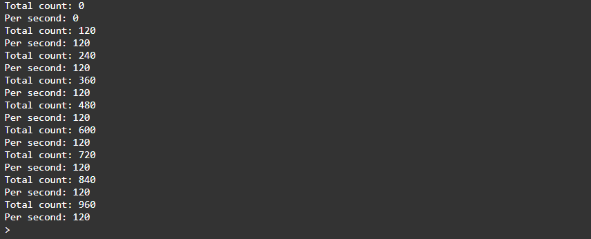

<div style = "font-family: 'Open Sans', sans-serif; font-size: 16px">

# ModulePulseCounter

<div style = "color: #555">
    <p align="center">
    
    </p>
</div>

## Лицензия

<div style = "color: #555">

В разработке
</div>

## Описание
<div style = "color: #555">

Модуль предназначен для мониторинга цифровых импульсов (фронта и/или спада сигнала) на портах.
Модуль разработан в соответствии с нотацией архитектуры датчиков и является потомком класса [ClassSensor](../../plcSensor/res/README.md). 

0-й канал отвечает за общий подсчет импульсов, 1-й - за кол-во импульсов/сек., 2-й - кол-во/мин. 

Примечание: в силу ограничений Espruino работать на частоте более ~220Гц непредсказуема

</div>

## Конструктор
<div style = "color: #555">

Конструктор принимает данные из конфига. Пример ниже:
```json
"22": {
    "pins": ["A5"],
    "name": "PulseSensor",
    "article": "",
    "type": "sensor",
    "channelNames": ["pulse"],
    "typeInSignal": "digital",
    "typeOutSignal": "digital",
    "quantityChannel": 1,
    "modules": ["plcPulseCounter.min.js"]
}
```

</div>

### Поля
<div style = "color: #555">

- <mark style="background-color: lightblue">_SetWatch</mark> - массив, в который сохраняются ссылки на функции setWatch каждого порта;
- <mark style="background-color: lightblue">_Values</mark> - массив, в котором хранится кол-во импульсов за последнюю секунду.

</div>

### Методы
<div style = "color: #555">

- <mark style="background-color: lightblue">Start(_chNum, _opts)</mark> - запускает подсчет импульсов;
- <mark style="background-color: lightblue">Stop(_chNum, _opts)</mark> - завершает подсчет импульсов.

</div>

### Примеры

Подключим к порту источник, генерирующий импульсы с частотой 120 Гц и запустим опрос датчика.
<div style = "color: #555">

```js
let pulseSensor = H.DeviceManager.Service.CreateDevice('22');
let total = pulseSensor[0];
let perSec = pulseSensor[1];

total.Start({edge:'falling', debounce: 0});

let a = setInterval(() => {
    console.log(`Total count: ${total.Value}`);
    console.log(`Per second: ${perSec.Value}`);
}, 250);

```

Результат выполнения:
<div align='center'>
    
</div>

</div>

### Зависимости
<div style = "color: #555">

- <mark style="background-color: lightblue">[plcSensor](../../plcSensor/res/README.md)</mark>
- <mark style="background-color: lightblue">[plcAppError](../../plcAppError/res/README.md)</mark>
</div>

</div>
