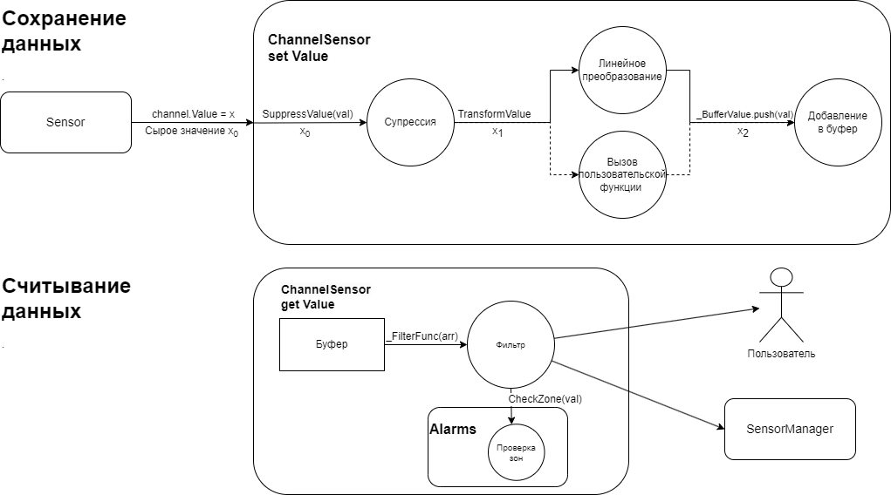

# ClassChannel

    

    
    

### Описание

Компонент [ModuleSensor](./README_MIDDLE.md), который представляет каждый отдельно взятый канал датчика. В парадигме фреймворка Horizon Automated именно через объект этого класса происходит прикладная работа с датчиком. Является "синглтоном" для основного объекта датчика. Хранит в себе ссылки на основной объект сенсора и "проброшенные" методы для работы с данным каналом датчика, включая аксессоры. 
Также данный класс композирует в себе сервисные классы (см. [ClassDataRefine](./README_DATA_REFINE.md) и [ClassAlarms](./README_ALARMS.md)), которые безусловно используются в [аксессорах](./README_MIDDLE.md#аксессоры) ClassMiddleSensor при обработке считываемых с датчика значений.

### Поля

- <mark style="background-color: lightblue">_Value</mark> - поле, в которое сохраняется последнее считанное значение *Value*;
- <mark style="background-color: lightblue">_ValueBuffer</mark> - буффера фиксированной длины, в котором сохраняются необработанные показания датчика;
- <mark style="background-color: lightblue">_DataUpdated</mark> - флаг указывающий на то что сохраненное ранее значение *_Value* уже не является актуальным;
- <mark style="background-color: lightblue">_DataWasRead</mark> - флаг указывающий на то что последнее актуальное значение *Value* уже было считано и сохранено;
- <mark style="background-color: lightblue">_Bypass</mark> - флаг, при взведении которого вх. значения будут становиться результирующими в обход мат. обработки;
- <mark style="background-color: lightblue">_ChangeThreshold</mark> - порог изменения - процент, на который должно измениться Value чтобы SM считал его новым;
- <mark style="background-color: lightblue">_Sensor</mark> - ссылка на основной объект датчика;
- <mark style="background-color: lightblue">_ChNum</mark> - номер канала;
- <mark style="background-color: lightblue">_Alarms</mark> - объект класса ClassAlarms;
- <mark style="background-color: lightblue">_Transform</mark> - объект класса ClassTransform;
- <mark style="background-color: lightblue">_Suppression</mark> - объект класса ClassSuppression;
- <mark style="background-color: lightblue">_FilterFunc</mark> - функция которая вызывается из ClassMiddleSensor и применяется для фильтрации значений. Принимает в качестве аргумента массив значений и возвращает одно число. По умолчанию фильтр-функция возвращает последнее значение.

### Аксессоры

- <mark style="background-color: lightblue">Value</mark> - сеттер в который **необходимо** записывать полученные с датчика необработанные значения  и с него же далее необходимо их считывать. При считывании значения через геттер "сырое" значение автоматически проходит через все этапы математической обработки, включая проверку зон измерения (см. диаграмму "Обработка значений с датчика" ниже);

- <mark style="background-color: lightblue">Suppression</mark> - возвращает объект *ClassSuppression*;
- <mark style="background-color: lightblue">Transform</mark> - возвращает объект *ClassTransform*;
- <mark style="background-color: lightblue">Alarms</mark> - возвращает объект *ClassAlarms* после его инициализации;
- <mark style="background-color: lightblue">AvgCapacity</mark> - емкость буфера, в котором хранятся вх. значения; 
- <mark style="background-color: lightblue">ID</mark> - возвращает идентификатор канала датчика;
- <mark style="background-color: lightblue">ChangeThreshold</mark> - процент, на который должно измениться показание с датчика, чтобы SM считал его обновившимся;
- <mark style="background-color: lightblue">Status</mark> - задает и возвращает текущий статус датчика (канала) в виде числового кода. 
    - 0 - канал не активен;
    - 1 - канал в работе;
    - 2 - датчик в переходном процессе

### Методы

- <mark style="background-color: lightblue">EnableAlarms()</mark> - создает объект *_Alarms*;
- <mark style="background-color: lightblue">ClearBuffer()</mark> - очищает буффер;
- <mark style="background-color: lightblue">Start(_chNum, _period, _opts)</mark>
- <mark style="background-color: lightblue">Stop(_chNum)</mark>
- <mark style="background-color: lightblue">ChangeFreq(_chNum, _period)</mark>
- <mark style="background-color: lightblue">Configure(_chNum, _opts)</mark>
- <mark style="background-color: lightblue">GetInfo(_chNum)</mark>
- <mark style="background-color: lightblue">Reset()</mark>
- <mark style="background-color: lightblue">SetRepeatability(_chNum, _rep)</mark>
- <mark style="background-color: lightblue">SetPrecision(_chNum, _pres)</mark>

Некоторые из этих методов ссылаются на соответствующий функционал, объявленный в **ClassSensor** и реализованный в прикладном классе датчика. Развернутое описание данных методов [по ссылке](./README_MIDDLE.md#методы).

### Обработка значений с датчика

В рамках реализации модуля любого датчика, считанное с него значение сохраняется через сеттер *Value* класса **ClassChannelSensor** в *_ValueBuffer* (кольцевой буфер). 

Перед добавлением в буфер значение проходит через супрессию и преобразование либо через линейную функцию, либо через функцию, установленную пользователем. 

При считывании значения *Value*, буфер обрабатывается функцией-фильтром, результат которой и возвращается пользователю. 

Если ранее был вызван метод *EnableAlarms()*, то при каждом обновлении буфера производится проверка зон измерения.

    

### Зависимости

- <mark style="background-color: lightblue">[plcAppError](../../plcAppError/res/README.md)</mark>

