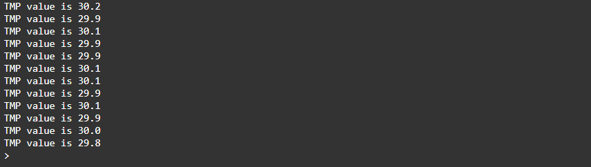

<div style = "font-family: 'Open Sans', sans-serif; font-size: 16px">

# ModuleThermoTMP36

<div style = "color: #555">
    <p align="center">
    
    </p>
</div>

## Лицензия

<div style = "color: #555">
В разработке
</div>

## Описание
<div style = "color: #555">

Модуль предназначен для работы с аналоговым датчиком температуры TMP36 в рамках фреймворка Horizon Automated. Разработан в соответствии с нотацией архитектуры датчиков и является потомком класса [ClassSensor](../../plcSensor/res/README.md). Количество каналов - 1. 

Датчик TMP36 представляет собой аналоговый температурный сенсор с линейным выходным напряжением, пропорциональным температуре. При увеличении температуры выходное напряжение увеличивается. Как и все аналоговые датчики, не гарантирует высокую точность.

TMP36 имеет следующие технические параметры: диапазон измерений температуры от -40°C до +125°C, точность ±2°C при температуре от -40°C до +125°C, выходное напряжение 750 мВ при 25°C, и чувствительность 10 мВ/°C. Рабочее напряжение составляет от 2,7 В до 5,5 В, а потребляемая мощность – менее 50 мкА.

</div>

## Конструктор
<div style = "color: #555">

Конструктор принимает данные из конфига. Пример ниже:
```json
"tmp": {
    "pins": ["A3"],
    "name": "TMP36",
    "article": "02-501-0105-201-0001",
    "type": "sensor",
    "channelNames": ["temperature"],
    "quantityChannel": 1,
    "modules": ["ModuleTMP36"]
}
```
</div>

### Поля
<div style = "color: #555">

- <mark style="background-color: lightblue">_Interval</mark> - поле для хранения ссылки на интервал опроса датчика.
</div>

### Методы
<div style = "color: #555">

- <mark style="background-color: lightblue">Start(_chNum, _freq)</mark> - запускает циклический опрос измерительного канала датчика;
- <mark style="background-color: lightblue">Stop(_chNum)</mark> - прекращает считывание значений с заданного канала;
</div>

### Возвращаемые данные
<div style = "color: #555">
Датчик возвращает значение температуры в градусах Цельсия. 

</div>

### Примеры
<div style = "color: #555">
Пример программы для вывода данных раз в одну секунду:

```js
//Создание объекта класса
let tmp = H.DeviceManager.Service.CreateDevice('tmp')[0];
// Запускаем опрос 
tmp.Start(300);

// Выводим в консоль значения пока канал вкл.
let interval = setInterval(() => {
    if (tmp.Status)
        console.log(`TMP value is ${(tmp.Value).toFixed(1)}`);
}, 2000);
```
Результат выполнения:
<div align='left'>
    
</div>

</div>

### Зависимости
<div style = "color: #555">

- <mark style="background-color: lightblue">[plcSensor](../../plcSensor/res/README.md)</mark>
- <mark style="background-color: lightblue">[plcAppError](../../plcAppError/res/README.md)</mark>
</div>

</div>
